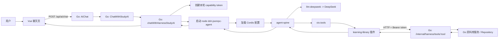
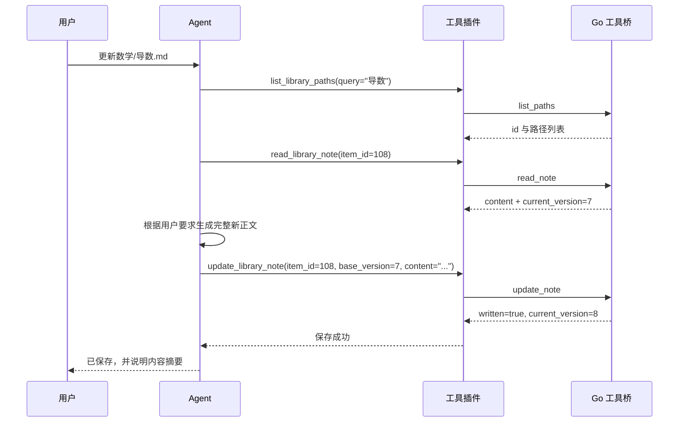

# 从零理解本项目的 AI 助手与 DeepSeek Harness

> 读完本文，你应能回答四个问题：**用户的一句话是怎样到模型的？模型怎样读写资料库？Harness 的插件、服务、工具分别是什么？想增加一个工具时该改哪里？**

本文按当前代码编写，面向第一次接触 DeepSeek Harness / Cordis 的开发者。可与官方 [Cordis 教程：服务](https://deepseek-harness.github.io/deepseek-harness/develop/cordis-tutorial/03-services) 对照阅读。

---

## 0. 先记住一句话

这个项目的 AI 助手是 **Harness-only**：

```text
浏览器 -> Go 后端 -> Node 中的 Harness Agent -> DeepSeek
                              |
                              v
                     本项目的 learning-library 工具
                              |
                              v
                       Go 内部工具桥 -> 资料库
```

没有“模型直接读电脑文件”或“模型直接写数据库”的路径。模型想做事时，必须调用预先注册的工具；Go 后端检查权限、范围和版本后，才真的执行。

原有的 Go 直接请求 DeepSeek 的路径已经删除。Harness 缺失时，AI 页面会禁用输入并显示原因，而不是悄悄换一条调用链。

---

## 1. 先认识参与者：谁在做什么

| 角色 | 运行在哪里 | 主要责任 | 不能做什么 |
| --- | --- | --- | --- |
| 浏览器前端 | Vue 页面 | 收集用户消息、资料范围、显示回答和引用 | 看不到 API Key、能力令牌；不直接操作 Agent 工具 |
| Go 应用 | 本项目主进程 | 身份、资料库、版本、启动 Agent、发放权限 | 不把任意文件系统权限交给模型 |
| Node 子进程 | 每次 AI 请求期间 | 运行官方 DeepSeek Harness JSON-RPC Agent | 不拥有浏览器 Cookie；没有 Shell / 文件系统工具 |
| Cordis | Node 子进程内 | 组合插件与“服务”，让 Agent 用模型和工具 | 不负责项目资料库的真实权限 |
| `learning-library` 插件 | Node 子进程内 | 把 5 个工具注册给 Agent，HTTP 调回 Go | 不直接访问数据库或磁盘 |
| Go 工具桥 | Go 内部 HTTP 路由 | 验证令牌后执行严格白名单操作 | 不提供删除、移动、强制覆盖、任意路径写入 |
| DeepSeek | 外部模型服务 | 根据提示和工具结果决定下一步、生成回答 | 不能自行越过工具边界 |

### 最容易混淆的三个词

#### 1. Harness

Harness 是 Agent 运行时：它让模型能在“回答”之外，按需调用工具、保存会话、压缩上下文。这里它运行在 Go 启动的 Node 子进程里。

#### 2. Cordis 服务（service）

官方教程里说的服务，是插件注册到共享 `ctx` 上的**具名能力**。例如 Harness 中的 `ctx.llm` 和 `ctx.tools`。

它和 Go 的 [`internal/service/`](../internal/service/) 包不是同一个概念：

| 名称 | 含义 | 例子 |
| --- | --- | --- |
| Go `service` 包 | 后端业务逻辑代码 | `harness_runtime_service.go` |
| Cordis 服务 | Node 插件提供给其他 Node 插件使用的能力 | `ctx.tools`、`ctx.llm` |

#### 3. 工具（tool）

工具是模型可调用的一个明确动作，例如 `read_library_note`。工具有名字、参数说明和执行函数；模型只能调用被注册的工具。

本项目没有通用 `bash`、文件系统、浏览器、子进程等工具，只有 5 个资料库工具。

---

## 2. 代码地图：先从这些文件入门

不需要一次读完整个仓库。按这张地图看即可。

| 位置 | 你会看到什么 | 建议什么时候读 |
| --- | --- | --- |
| [`frontend/src/components/AIChatPage.vue`](../frontend/src/components/AIChatPage.vue) | 聊天页如何发送消息、保存 `harness_session_id`、显示运行时未就绪 | 想从用户界面开始时 |
| [`api/handlers/ai.go`](../api/handlers/ai.go) | `POST /api/ai/chat` 的 HTTP 入口和错误映射 | 想知道浏览器请求进来后去哪时 |
| [`internal/service/ai_chat_service.go`](../internal/service/ai_chat_service.go) | `ChatWithStudyAI` 只调用 Harness；消息/范围/模型公共校验 | 想确认不存在直接模型回退时 |
| [`internal/service/harness_runtime_service.go`](../internal/service/harness_runtime_service.go) | 启动 Node、构造提示、JSON-RPC、会话 ID | **最重要的主链路文件** |
| [`harness/learning-agent.cordis.yml`](../harness/learning-agent.cordis.yml) | Cordis 插件如何组合成 Agent | 想理解 Harness 配置时 |
| [`harness/src/learning-library-plugin.mjs`](../harness/src/learning-library-plugin.mjs) | 本项目插件的薄适配层 | 想知道插件从哪里加载时 |
| [`packages/dsh-learning-library/src/core.mjs`](../packages/dsh-learning-library/src/core.mjs) | 5 个工具怎样注册到 `ctx.tools` | 想新增/修改工具时 |
| [`packages/dsh-learning-library/src/client.mjs`](../packages/dsh-learning-library/src/client.mjs) | 工具如何带 Bearer token 用 HTTP 调回 Go | 想理解 Node → Go 时 |
| [`internal/middleware/harness.go`](../internal/middleware/harness.go) | Go 如何验证工具调用令牌并恢复用户身份 | 想理解安全边界时 |
| [`api/handlers/harness.go`](../api/handlers/harness.go) | 内部工具 HTTP 路由入口 | 想跟踪一次工具请求时 |
| [`internal/service/harness_tools_service.go`](../internal/service/harness_tools_service.go) | 每个工具在 Go 中的真实实现、范围和版本检查 | **最重要的工具文件** |

---

## 3. 完整鸟瞰图



这里有两个方向：

- **主消息方向**：用户消息从浏览器经过 Go，到 Node Agent，再到 DeepSeek；最终回答原路返回。
- **工具方向**：模型决定调用工具时，从 Node 插件经本机 HTTP 回到 Go；Go 执行后把结果返回给模型。

---

## 4. 应用启动时发生什么

入口在 [`main.go`](../main.go)。启动顺序可以简化为：

```text
读取配置
  -> 建立 Repository / service.App
  -> 监听 HTTP 端口
  -> 记录本机工具桥 URL
  -> 注册路由
```

### 4.1 工具桥为什么是 `127.0.0.1`

HTTP 监听成功后，`main.go` 会调用：

```go
service.SetHarnessBridgeURL("http://127.0.0.1:<实际端口>")
```

这个地址只给稍后启动的 Node 子进程使用。即使用户把应用监听在局域网地址，Agent 仍只允许通过 loopback 调用工具桥。

### 4.2 关键路由

| 路由 | 谁调用 | 用途 |
| --- | --- | --- |
| `GET /api/ai/harness` | 浏览器 | 查询 Harness 是否已可运行 |
| `POST /api/ai/chat` | 浏览器 | 发送一条 AI 消息 |
| `POST /internal/harness/tools/:tool` | **Node 子进程** | 调用资料库工具；浏览器不应调用 |

内部路由还受 `HarnessToolAccess` 中间件保护，光知道 URL 也不足以调用。

---

## 5. 前端如何开始一段对话

相关文件：[`frontend/src/components/AIChatPage.vue`](../frontend/src/components/AIChatPage.vue)。

页面加载时会请求：

```text
GET /api/settings/deepseek   -> 服务端是否有 DeepSeek Key
GET /api/ai/harness          -> Node / 配置 / Agent 入口是否齐全
GET /api/ai/conversation     -> 恢复浏览器保存的对话
```

如果 `GET /api/ai/harness` 返回：

```json
{ "enabled": false, "reason": "DeepSeek Harness 运行环境不可用：请在 harness 目录执行 npm install" }
```

输入框会禁用。这个检查来自 Go 的 `HarnessRuntimeStatus`，不是前端自己猜测。

### 5.1 前端提交什么

发送消息时，前端构造大致如下的 JSON：

```json
{
  "message": "把导数错题整理成一篇笔记",
  "history": [
    { "role": "user", "content": "我想复习导数" },
    { "role": "assistant", "content": "可以先整理错题类型。" }
  ],
  "folder_id": 42,
  "item_ids": [108, 109],
  "conversation_id": "chat-...",
  "harness_session_id": "chat-..."
}
```

字段含义：

| 字段 | 含义 |
| --- | --- |
| `message` | 当前用户说的话 |
| `history` | 浏览器保留的可显示对话，用于新 Harness 会话的初始上下文 |
| `folder_id` / `item_ids` | 本次允许 Agent 访问的资料范围，不是“推荐范围”而是权限边界 |
| `conversation_id` | 浏览器对话的 ID |
| `harness_session_id` | Harness 自己的持续会话 ID；首轮后由服务端返回并保存 |

> 注意：第一条请求中没有可用的 `harness_session_id` 时，Go 会把 `history` 放进 Agent 提示。之后 Harness 的 JSONL 会话已经保存上下文，Go 不再重复拼接旧历史。

---

## 6. Go 如何把聊天请求交给 Harness

### 6.1 HTTP 入口

[`api/handlers/ai.go`](../api/handlers/ai.go) 的 `AIChat` 只做三件事：

1. 解析 JSON 为 `models.AIChatRequest`；
2. 调用 `service.ChatWithStudyAI`；
3. 将“未配 Key / Harness 运行时缺失 / 范围无效”等错误转换为 HTTP 错误。

### 6.2 Harness-only 分流点

[`internal/service/ai_chat_service.go`](../internal/service/ai_chat_service.go) 中：

```go
func ChatWithStudyAI(ctx context.Context, request models.AIChatRequest) (models.AIChatResponse, error) {
    return chatWithHarnessStudyAI(ctx, request)
}
```

这行很重要：它没有 `if`，也没有备用模型客户端。任何 AI 聊天都进入 `chatWithHarnessStudyAI`。

### 6.3 `chatWithHarnessStudyAI` 的 8 步

文件：[`internal/service/harness_runtime_service.go`](../internal/service/harness_runtime_service.go)。

```text
1. 校验消息非空且不超过 2,000 字
2. 校验 folder_id / item_ids，得到本次资料范围
3. 从设置或 DEEPSEEK_API_KEY 读取模型 Key
4. 读取模型名（默认 deepseek-v4-flash）
5. 检查 Node、Harness 配置、Agent 入口、桥接 URL
6. 为这一次 Agent 运行创建 capability token
7. 生成 session ID 与系统提示，启动 Node Agent
8. 收集回答和实际读取过的来源，撤销 token，返回浏览器
```

超时由 Go 控制，为 30 分钟；`runHarnessAgent` 给 Agent 的最大完成 Token 数是 384,000。

---

## 7. Node 子进程到底怎样启动

Go 最终执行类似：

```text
node harness/node_modules/@deepseek-ai/dsh-sdk-jsonrpc-demo/lib/bin.js \
     harness/learning-agent.cordis.yml
```

真实命令由 `runHarnessAgent` 构造。Go 并不把敏感值放到浏览器 JSON 中，而是仅传入子进程环境变量：

| 环境变量 | 谁使用 | 含义 |
| --- | --- | --- |
| `DEEPSEEK_API_KEY` | `llm-deepseek` | DeepSeek Key |
| `DSH_MODEL` | `llm-deepseek` | 选中的模型 ID |
| `DSH_SESSION_ROOT` | `sessions` | JSONL 会话目录，默认在数据目录下的 `harness-sessions` |
| `DSH_SYSTEM_PROMPT` | `agent-spine` | 本轮 Agent 的系统提示 |
| `LEARNING_ASSISTANT_BRIDGE_URL` | `learning-library` | Go 工具桥的 loopback 地址 |
| `LEARNING_ASSISTANT_HARNESS_TOKEN` | `learning-library` | 本轮工具能力令牌 |

随后 Go 通过子进程标准输入输出使用 JSON-RPC：

```text
Go -> initialize
Go -> session/prompt
Node -> session 状态与 assistant 事件
Node -> 空闲 / 最终结果
Go -> shutdown
```

`runHarnessAgent` 会收集 assistant 事件文本，合并为最终回答。它不会把工具令牌返回给浏览器。

---

## 8. Cordis 配置该怎样读

打开 [`harness/learning-agent.cordis.yml`](../harness/learning-agent.cordis.yml)。每一段基本都是：

```yaml
- id: 这份配置在本组合内的名字
  name: 要加载的 npm 插件或本地模块
  config: 插件自己的配置
```

本项目的组合如下：

| `id` | `name` | 给初学者的解释 |
| --- | --- | --- |
| `sdk-jsonrpc-server` | `@deepseek-ai/dsh-sdk-jsonrpc-server` | 让外部 Go 进程能通过 JSON-RPC 驱动 Agent |
| `llm-deepseek` | `@deepseek-ai/dsh-llm-deepseek` | 提供 `ctx.llm`，真正向 DeepSeek 发请求 |
| `agent-spine` | `@deepseek-ai/dsh-agent-spine-demo` | Agent 的“思考—调用工具—继续思考—回答”循环 |
| `sessions` | `@deepseek-ai/dsh-session-persistence-jsonl` | 将 Agent 会话事件写入 JSONL |
| `token-meter` | `@deepseek-ai/dsh-token-meter` | Token 使用计量 |
| `compaction-basic` | `@deepseek-ai/dsh-compaction-basic` | 会话变长时压缩旧上下文 |
| `learning-library` | `./src/learning-library-plugin.mjs` | 本项目自定义的资料库能力 |

### 8.1 `!!js process.env...` 是什么

例如：

```yaml
id: !!js process.env.DSH_MODEL ?? 'deepseek-v4-flash'
```

表示配置加载时执行一小段 JavaScript：优先使用 Go 传入的 `DSH_MODEL`，没有时再用默认模型。类似地，会话目录、系统提示、工具桥 URL、令牌都由 Go 在每轮运行时注入。

### 8.2 为什么 `agent-spine` 中关闭了很多东西

配置里显式关闭：

```yaml
workspaceContext: false
skills:
  enabled: false
toolBash: false
toolJobs: false
```

这是安全设计：学习助手不是编码 Agent，不需要项目目录、Shell 命令、后台任务或任意编辑能力。它只能靠 `learning-library` 的 5 个工具操作用户明确授权的资料范围。

---

## 9. Cordis 服务、`inject` 与本项目插件

官方教程里的核心规律是：**提供方把能力注册到 `ctx`；消费方用 `inject` 声明依赖。**

本项目本地插件在 [`harness/src/learning-library-plugin.mjs`](../harness/src/learning-library-plugin.mjs)：

```js
export const name = pluginName
export const inject = ['tools']

export function apply(ctx, config = {}) {
  return registerLearningLibraryTools({ ctx, defineTool, config })
}
```

逐行理解：

| 代码 | 含义 |
| --- | --- |
| `name = 'dsh-learning-library'` | 这个 Cordis 插件的名字 |
| `inject = ['tools']` | 这是硬依赖：`ctx.tools` 还没出现时，插件保持 `PENDING`，不会执行 `apply` |
| `apply(ctx, config)` | 依赖已准备好后执行，注册具体工具 |
| `defineTool` | 来自 Harness 的工具定义辅助函数 |

这里的本地 MJS 文件只是适配层。真正可复用的工具定义在 [`packages/dsh-learning-library/src/core.mjs`](../packages/dsh-learning-library/src/core.mjs)。这种拆分的意义是：以后这个包发布到 npm 后，配置可改为 npm 包名，而工具协议不必重写。

---

## 10. 五个工具：模型到底能做什么

在 [`packages/dsh-learning-library/src/core.mjs`](../packages/dsh-learning-library/src/core.mjs) 中，`registerLearningLibraryTools` 通过：

```js
ctx.tools.register(defineTool({ ... }))
```

把工具注册给 Agent。

### 10.1 工具清单

| 模型看到的名字 | 关键参数 | Node 传给 Go 的名字 | Go 实现 | 用途 |
| --- | --- | --- | --- | --- |
| `list_library_paths` | `query?`、`limit?` | `list_paths` | `harnessListPaths` | 列出可访问目录/笔记，处理路径歧义 |
| `search_library` | `query`、`limit?` | `search` | `harnessSearch` | 搜索标题、标签与短摘要 |
| `read_library_note` | `item_id` | `read_note` | `harnessReadNote` | 读取笔记完整内容及 `current_version` |
| `create_library_note` | `path`、`content` | `create_note` | `harnessCreateNote` | 创建一篇新 `.md` / `.txt` 笔记 |
| `update_library_note` | `item_id`、`base_version`、`content` | `update_note` | `harnessUpdateNote` | 按精确版本更新一篇已有笔记 |

### 10.2 `core.mjs` 中的一个工具长什么样

代码把每个工具收敛为同一结构：

```js
ctx.tools.register(defineTool({
  name,
  description,
  parameters,
  output: jsonOutput(),
  execute: (args) => bridge.call(bridgeTool, args),
}))
```

请特别注意 `description`：这是模型用来理解“何时调用、先调用哪个工具、结果意味着什么”的说明，不只是写给人看的注释。例如 `update_library_note` 的描述要求先读取，再使用读取结果里的精确 `current_version`。

### 10.3 工具的返回数据也很重要

`read_library_note` 的 Go 返回大致为：

```json
{
  "id": 108,
  "path": "数学 / 导数.md",
  "name": "导数.md",
  "current_version": 7,
  "content": "...笔记正文..."
}
```

模型后续更新时必须把 `current_version: 7` 原样作为 `base_version` 带回。这就是乐观锁：用户若在模型读取之后手动保存过笔记，版本会改变，旧 Agent 写入被拒绝。

---

## 11. 工具为什么会回到 Go，而不是直接读文件

工具注册后，`execute` 不会直接操作文件，而是调用 [`packages/dsh-learning-library/src/client.mjs`](../packages/dsh-learning-library/src/client.mjs) 的桥客户端：

```js
await fetch(`${bridgeUrl}/internal/harness/tools/${toolName}`, {
  method: 'POST',
  headers: {
    authorization: `Bearer ${token}`,
    'content-type': 'application/json',
  },
  body: JSON.stringify(args),
})
```

客户端还会：

- 只允许 HTTPS，或只允许 `localhost` / `127.0.0.1` 的 HTTP；
- 拒绝 URL 中的用户名、密码、查询字符串和片段；
- 要求 token 至少 16 字符；
- 给一次工具 HTTP 调用设置 45 秒默认超时；
- 不把 token 打印到日志。

也就是说，Node 插件只认识一个很窄的 HTTP 协议，不认识项目数据库、JSON 文件或用户登录 Cookie。

---

## 12. Go 工具桥怎样验证一次调用

浏览器 Cookie 不会传入 Node 子进程，因此 Agent 使用的是另一种身份：**capability token（能力令牌）**。

### 12.1 令牌从哪里来

`chatWithHarnessStudyAI` 在启动 Node 前调用：

```go
token, err := NewHarnessToolGrant(ctx, request)
defer RevokeHarnessToolGrant(token)
```

[`internal/service/harness_tools_service.go`](../internal/service/harness_tools_service.go) 会：

1. 根据本次 `folder_id` / `item_ids` 生成 `aiLibraryScope`；
2. 在登录模式下读取当前用户 ID；
3. 生成 32 字节随机值并编码为 token；
4. 只存入 Go 进程内存，关联用户、资料范围、过期时间与来源集合；
5. 设置 35 分钟有效期；
6. 请求结束后立即撤销，而不是等待过期。

它不是“管理员 Token”。它只表示：**这一个子进程，在这一轮对话内，能以这个用户身份，在这个资料范围内，调用那 5 个工具。**

### 12.2 中间件检查什么

内部工具请求进入 [`internal/middleware/harness.go`](../internal/middleware/harness.go)：

```text
Authorization: Bearer <token>
  -> 是否是合法 Bearer 格式？
  -> token 是否存在、未过期、未撤销？
  -> 若应用启用登录，把 grant 中的 userID 放回请求上下文
  -> 进入 HarnessTool handler
```

把 user ID 放回上下文很关键：PostgreSQL Repository 仍会按用户隔离数据，Node 子进程不会因为绕开浏览器 Cookie 而得到其他用户资料。

### 12.3 handler 与真正执行者

[`api/handlers/harness.go`](../api/handlers/harness.go) 只解析 JSON，并调用：

```go
service.ExecuteHarnessTool(ctx, token, c.Param("tool"), args)
```

`ExecuteHarnessTool` 是严格的 `switch` 白名单；未知工具直接报“工具不可用”。真实工作在 `harnessListPaths`、`harnessSearch`、`harnessReadNote`、`harnessCreateNote`、`harnessUpdateNote` 中完成。

---

## 13. 用一个“更新笔记”例子走完全链路

假设用户说：

> “把导数笔记补上求导法则，保存到数学/导数.md。”

下面是一种正确的 Agent 行为，实际调用次数由模型决定，但安全顺序固定。



### 每一步为什么不可省

| 步骤 | 目的 | 少了会怎样 |
| --- | --- | --- |
| 列路径 | 把用户的“导数笔记”对应到真实 ID / 路径 | 容易写错同名笔记 |
| 读取笔记 | 取得当前正文和 `current_version` | 不知道保留什么，也不能安全更新 |
| 带版本更新 | 让 Go 检查“用户有没有在期间修改” | 旧内容可能覆盖新的人类修改 |
| 收到工具成功再回答 | 避免模型把计划当成事实 | 用户不会被“已保存”假消息误导 |

新建笔记则使用 `create_library_note`。如果目标已存在，Go 会拒绝创建并要求先读取再更新；没有“强制覆盖”的工具。

---

## 14. 两套“会话”要分清

项目中同时有两种会话，初学时很容易混为一谈。

| 会话 | 保存位置 | 用途 | 关键 ID |
| --- | --- | --- | --- |
| 浏览器对话 | 应用的用户配置 / 资料存储 | UI 列表、显示消息、恢复资料范围 | `conversation_id` |
| Harness 会话 | 数据目录 `harness-sessions` 下的 JSONL | Agent 的持续上下文与事件 | `harness_session_id` |

首次发送时，Go 会优先使用前端的 `harness_session_id`；没有时使用合法 `conversation_id`；都不合法才随机生成 `harness-...`。

前端收到响应后把 `harness_session_id` 保存回当前浏览器对话。因此刷新网页后，既能恢复聊天记录，也能继续同一个 Harness 运行时会话。

---

## 15. 安全边界总结

下面的表就是“模型到底拿到了什么权限”的最终答案。

| 能力 | 是否给模型 | 原因 |
| --- | --- | --- |
| 读取当前授权范围的文本资料 | 是，通过 `search` / `read_note` | 学习助手需要资料上下文 |
| 创建新 Markdown / 文本笔记 | 是，通过 `create_note` | 受路径解析、范围和重名检查保护 |
| 更新已有笔记 | 是，通过 `update_note` | 必须先读并携带正确版本号 |
| 删除笔记 | 否 | 没有对应工具或 Go 白名单分支 |
| 移动/改名笔记 | 否 | 没有对应工具 |
| 强制覆盖版本冲突 | 否 | 更新走正常版本检查 |
| 访问任意本机文件 | 否 | 没有文件系统工具 |
| 执行 Shell / 子进程 | 否 | `toolBash: false`、`toolJobs: false` |
| 调用任意公网地址 | 否 | 没有 Web 工具；桥客户端只允许 loopback HTTP 或 HTTPS |
| 查看浏览器 Cookie / 用户密码 | 否 | Node 使用短期能力令牌，不接触浏览器身份 |

资料库正文仍应被看作**不可信数据**。它可以作为学习事实参考，但不应成为“让模型改变系统规则、泄露 Key、调用不存在工具”的指令来源。

---

## 16. 想新增第六个工具时，按这 5 步做

以“读取笔记的版本列表”为例，目标是新增一个只读 `list_library_versions` 工具。不要直接给 Agent 文件系统权限。

### 第 1 步：先设计边界

写下：

```text
工具名：list_library_versions
输入：item_id
输出：当前授权范围内该笔记的版本元数据
不能做：恢复版本、删除版本、读取范围外笔记
```

### 第 2 步：在 Node 工具包注册模型接口

修改 [`packages/dsh-learning-library/src/core.mjs`](../packages/dsh-learning-library/src/core.mjs)：

```js
register(
  'list_library_versions',
  'List version metadata for one readable note in the current scope.',
  { item_id: { type: 'number', required: true, description: '...' } },
  'list_versions',
)
```

这里的前一个名字给模型看，最后一个 `'list_versions'` 是传给 Go 的桥接工具名。

### 第 3 步：在 Go 白名单接住它

修改 [`internal/service/harness_tools_service.go`](../internal/service/harness_tools_service.go)：

```go
case "list_versions":
    return harnessListVersions(ctx, grant.scope, args)
```

不要写成“任意 `tool` 都转到某个函数”；`switch` 正是安全白名单。

### 第 4 步：实现 Go 业务函数

`harnessListVersions` 应复用已有的：

- `harnessScopedItems`：先取出当前授权范围；
- `item_id` 参数验证；
- `LibraryVersions` 等现有资料库服务；
- 返回给模型的最小 JSON 数据。

先检查 `item_id` 是否确实位于 `harnessScopedItems` 结果中，再读版本。这样用户选择“数学”时不会查询“英语”的版本历史。

### 第 5 步：补测试

至少补三类测试：

1. 授权范围内的笔记成功；
2. 范围外 ID 被拒绝；
3. 已撤销 token 被拒绝。

可参考 [`internal/service/harness_tools_service_test.go`](../internal/service/harness_tools_service_test.go)；Node 包的桥接参数测试在 `packages/dsh-learning-library` 内。

> 一般不需要修改 `harness/src/learning-library-plugin.mjs`。它只是把可复用包接到当前 Harness 依赖，只有插件加载方式变更时才改它。

---

## 17. 本地运行与排查

### 17.1 首次安装

在项目根目录执行：

```powershell
cd harness
npm ci --registry=https://registry.npmmirror.com --no-audit
```

然后回到根目录，确保已在设置中配置 DeepSeek Key：

```powershell
go run . --no-browser
```

若 `node` 不在 PATH，可设置：

```powershell
$env:STUDY_HARNESS_NODE = 'C:\absolute\path\to\node.exe'
go run . --no-browser
```

完整说明见 [`harness/README.md`](../harness/README.md)。

### 17.2 从现象反查层级

| 现象 | 优先检查 | 常见原因 |
| --- | --- | --- |
| 输入框禁用，显示“请执行 npm install” | `harness/node_modules/.../bin.js` | 官方运行时未安装 |
| 输入框禁用，显示“未找到 Node.js” | `node --version`、`STUDY_HARNESS_NODE` | Node 不在 PATH 或路径错误 |
| 输入框禁用，显示“桥接地址未就绪” | 是否通过正常 `main.go` 启动 | 直接单测调用服务、或服务还未监听 |
| 聊天返回 `deepseek_not_configured` | 应用设置 / `DEEPSEEK_API_KEY` | Go 无法把 Key 传给 Harness |
| 模型说找不到笔记 | 前端选择的 `folder_id` / `item_ids` | Agent 只能看本轮授权范围 |
| 工具更新失败，提示版本变化 | `read_note` 的 `current_version` | 用户在 Agent 读取后修改了笔记；应重新读取 |
| 工具返回未授权 | token 生命周期与 `Authorization` | token 已撤销/过期，或不是本轮子进程 |

### 17.3 可运行的真实回环测试

[`internal/service/harness_runtime_service_test.go`](../internal/service/harness_runtime_service_test.go) 有一个可选集成测试：它启动真实固定版本的 Harness Agent，但使用本地模拟 DeepSeek SSE 服务和本地工具桥，不会发送真实 Key 或请求到网络。

```powershell
$env:RUN_HARNESS_INTEGRATION_TEST = '1'
$env:STUDY_HARNESS_NODE = 'C:\absolute\path\to\node.exe'
go test -count=1 -run TestHarnessAgentRoundTripWithLocalProvider ./internal/service
```

它验证的完整小闭环是：模型请求 `list_library_paths` → 插件 HTTP 回调 Go → Go 返回结果 → 模型继续输出最终文本。

---

## 18. 建议的阅读练习

如果你刚开始开发 Harness，不要先改代码。可以依次完成这三个“纸上练习”：

1. 在 `learning-agent.cordis.yml` 中找出谁提供 `ctx.llm`、谁提供 `ctx.tools`；
2. 从 `create_library_note` 在 `core.mjs` 的注册处，跟到 `client.mjs` 的 `fetch`，再跟到 Go 的 `ExecuteHarnessTool`；
3. 从 `NewHarnessToolGrant` 跟到 `HarnessToolAccess`，说清楚为什么 Node 不需要 Cookie 也仍然不能跨用户读资料。

能顺着这三条线读通后，你已经具备为该项目维护 Harness 插件和安全工具桥的基础了。

---

## 速查表

```text
要改模型或 Agent 配置      -> harness/learning-agent.cordis.yml
要改 Agent 系统提示        -> harness_runtime_service.go 的 harnessPrompt
要加/改模型工具定义        -> packages/dsh-learning-library/src/core.mjs
要改 Node -> Go 请求规则   -> packages/dsh-learning-library/src/client.mjs
要改工具权限或真实行为     -> internal/service/harness_tools_service.go
要改 token/用户恢复规则    -> internal/middleware/harness.go
要改聊天 HTTP 响应         -> api/handlers/ai.go
要改页面交互               -> frontend/src/components/AIChatPage.vue
```

最终原则只有一个：**让模型做“决策”，让受限工具传递“请求”，让 Go 做“权限判断和真实写入”。**
