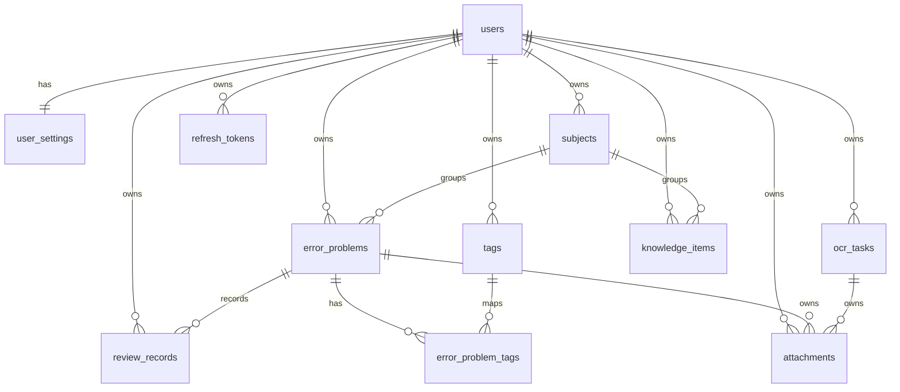

# PostgreSQL 数据库设计

本文档描述 Study Tracker 的 PostgreSQL 版本数据表设计。当前 Go 版本仍可以使用本地 JSON 文件运行；当项目升级到多人使用、云端同步、统计分析或毕设演示环境时，可以按本文方案迁移到 PostgreSQL。

## 设计目标

- 支持多用户：所有业务数据都通过 `user_id` 隔离。
- 支持错题核心流程：录入错题、分类、标签、复习计划、复习记录、归档。
- 支持 OCR 流程：记录上传文件、识别任务、识别结果、失败原因。
- 支持后续扩展：通过 `jsonb` 保存非核心元数据，但核心查询字段仍使用普通列。
- 支持统计分析：保留复习记录、题目难度、科目、标签和时间字段。
- 支持面试说明：使用分层清晰的关系模型，避免把所有数据存在一个 JSON 字段里。

## 命名与约定

- 主键使用 `BIGINT GENERATED ALWAYS AS IDENTITY`，方便本地开发、排序和调试。
- 时间字段统一使用 `TIMESTAMPTZ`，数据库默认 `now()`。
- 可软删除的表使用 `deleted_at`，业务查询默认过滤 `deleted_at IS NULL`。
- 简单状态使用 `CHECK` 约束，暂不使用 PostgreSQL enum，方便后续迁移。
- 用户维度唯一性使用部分唯一索引，例如同一用户下未删除的科目名称唯一。
- 大文本搜索先使用 PostgreSQL 内置全文检索；中文分词后续可以接入 `pg_jieba`、Meilisearch 或 Elasticsearch。

## 核心表

### users

用户账号表。后续接入登录注册、JWT、云同步时使用。

关键字段：

- `username`：用户名。
- `email`：邮箱，可为空。
- `password_hash`：密码哈希。
- `status`：`active`、`disabled`、`deleted`。
- `last_login_at`：最后登录时间。

### user_settings

用户设置表。适合保存主题、仪表盘偏好、OCR token 加密值等信息。

关键字段：

- `display_name`：展示名称。
- `mineru_token_cipher`：加密后的 MinerU Token。
- `settings`：其他设置，使用 `jsonb`。

### subjects

科目表。对应当前项目里的学科分类。

关键字段：

- `name`：科目名称。
- `sort_order`：排序值。

### error_problems

错题主表，是项目最核心的数据表。

关键字段：

- `subject_id`：所属科目。
- `title`：题目标题。
- `question`：题干。
- `wrong_answer`：错误答案。
- `correct_answer`：正确答案。
- `reason`：错因分析。
- `difficulty`：难度，建议范围 0-5。
- `source`：来源，例如 `manual`、`ocr`、`import`。
- `review_count`：复习次数。
- `review_stage`：复习阶段。
- `next_review_at`：下次复习日期。
- `last_reviewed_at`：最后复习时间。
- `archived_at`：归档时间。
- `metadata`：额外信息，例如原始导入字段、前端临时属性。

### tags 与 error_problem_tags

标签表和错题标签关联表。

`tags.tag_type` 分为：

- `question`：普通题目标签。
- `reason`：错因标签。

这样既能支持“知识点标签”，也能支持“粗心、概念不清、计算错误”等错因分析。

### review_records

复习记录表。每次复习都写一条记录，用于统计趋势、复习效果和间隔算法优化。

关键字段：

- `review_no`：该题第几次复习。
- `result`：`remembered`、`forgotten`、`skipped`。
- `reviewed_at`：复习时间。
- `next_review_at`：本次复习后计算出的下次复习日期。
- `duration_seconds`：用时。
- `note`：复习备注。

### ocr_tasks

OCR 任务表。记录每次上传和识别任务，避免前端只看到一个临时状态。

关键字段：

- `provider`：OCR 服务商，例如 `mineru`。
- `status`：`pending`、`uploading`、`processing`、`succeeded`、`failed`、`canceled`。
- `source_filename`：原始文件名。
- `file_size`：文件大小。
- `batch_id` / `task_id`：第三方平台返回的任务标识。
- `result_markdown`：识别后的 Markdown。
- `error_message`：失败原因。
- `metadata`：第三方原始响应摘要等。

### attachments

附件表。用于保存图片、PDF、OCR 原文件、题目截图等资源索引。

关键字段：

- `error_problem_id`：可关联错题。
- `ocr_task_id`：可关联 OCR 任务。
- `storage_type`：`inline`、`local`、`object`。
- `storage_key`：本地路径或对象存储 key。
- `checksum`：文件校验值。

### knowledge_items

知识点表。用于仪表盘右侧知识点、后续知识网络或复习建议。

关键字段：

- `subject_id`：可选科目。
- `content`：知识点内容。
- `source`：来源，例如 `manual`、`ocr`、`analysis`。
- `metadata`：掌握程度、关联题目等扩展信息。

### refresh_tokens

登录刷新令牌表。后续如果做 Web 登录、桌面端云同步或移动端，建议保留。

关键字段：

- `token_hash`：令牌哈希，不直接存明文 token。
- `expires_at`：过期时间。
- `revoked_at`：撤销时间。
- `user_agent`、`ip_address`：登录环境。

## 关系概览



## 查询场景与索引

### 仪表盘优先复习

使用 `error_problems(user_id, next_review_at)` 的部分索引，查询未归档、未删除、到期的错题：

```sql
SELECT *
FROM error_problems
WHERE user_id = $1
  AND deleted_at IS NULL
  AND archived_at IS NULL
  AND next_review_at <= CURRENT_DATE
ORDER BY next_review_at ASC, difficulty DESC, created_at ASC
LIMIT 20;
```

### 科目错题列表

使用 `(user_id, subject_id, created_at DESC)` 索引：

```sql
SELECT *
FROM error_problems
WHERE user_id = $1
  AND subject_id = $2
  AND deleted_at IS NULL
ORDER BY created_at DESC
LIMIT 50 OFFSET 0;
```

### 搜索错题

先使用 PostgreSQL `to_tsvector('simple', ...)` 建 GIN 索引。中文精确分词要求更高时，再升级为 `pg_jieba` 或外部搜索服务。

```sql
SELECT *
FROM error_problems
WHERE user_id = $1
  AND deleted_at IS NULL
  AND to_tsvector('simple',
      coalesce(title, '') || ' ' ||
      coalesce(question, '') || ' ' ||
      coalesce(correct_answer, '') || ' ' ||
      coalesce(reason, '')
  ) @@ plainto_tsquery('simple', $2);
```

## 后续迁移建议

第一阶段可以先实现 PostgreSQL repository，但保留当前 JSON repository 作为单机模式。接口层和 service 层不需要关心数据来源。

第二阶段加入登录注册和用户隔离，默认本地用户可以迁移为 `users.id = 1`。

第三阶段加入同步、对象存储、统计报表和更完整的复习算法。届时可以围绕 `review_records` 做按天统计、遗忘率统计、科目掌握度统计。

